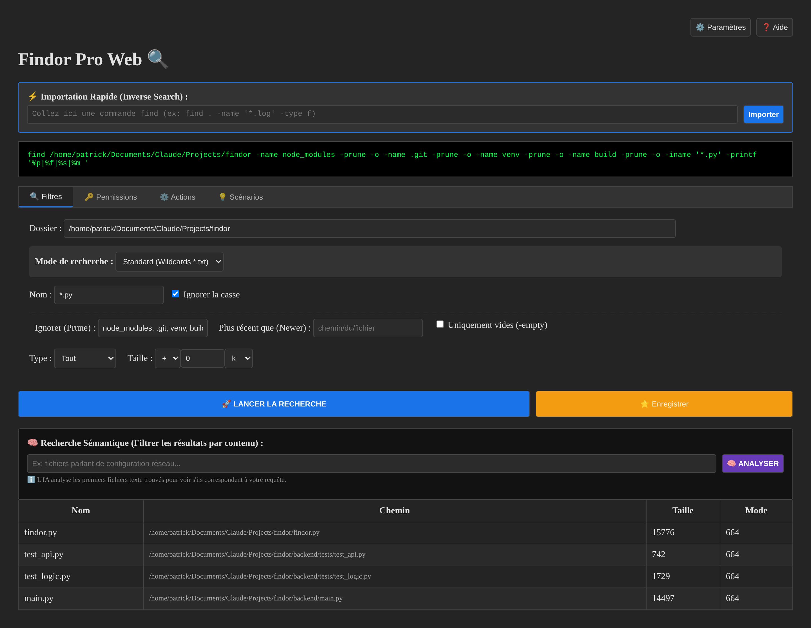
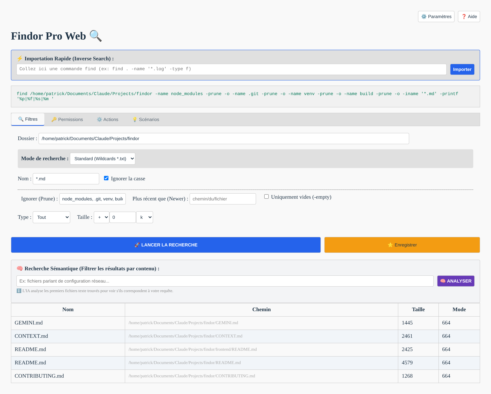
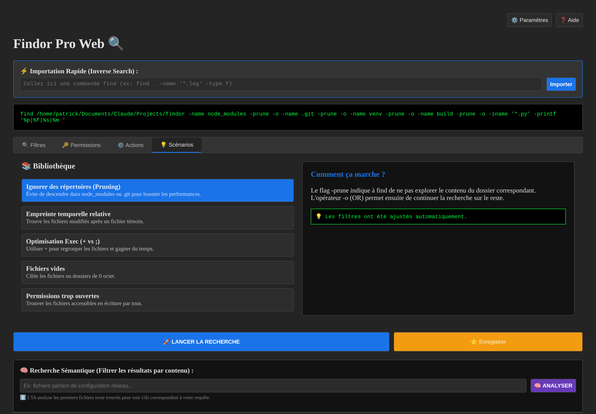
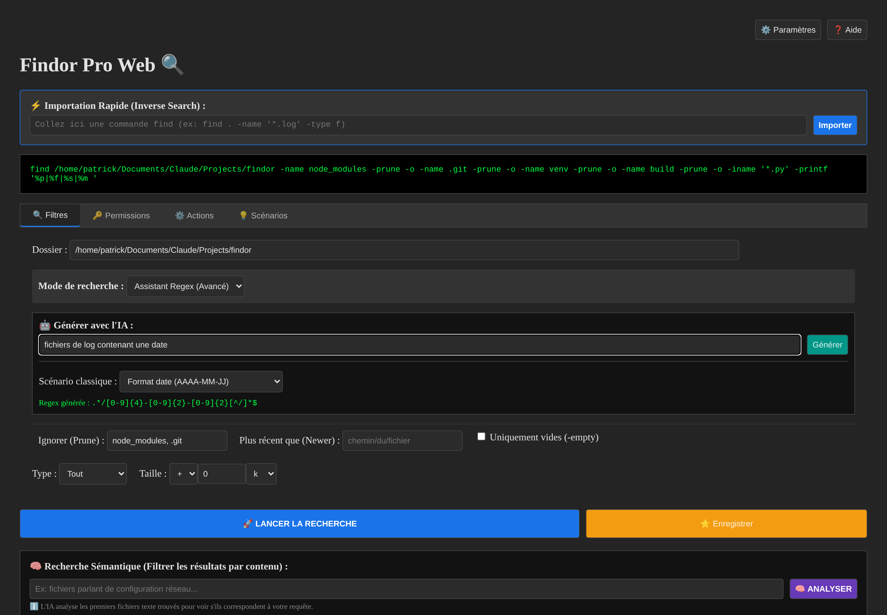
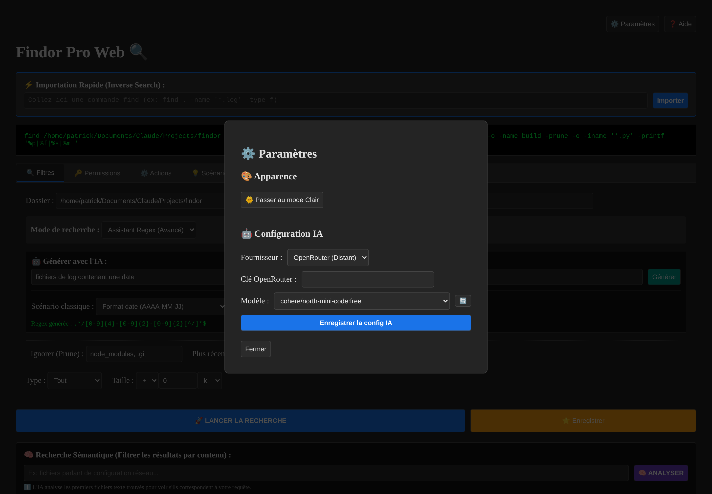
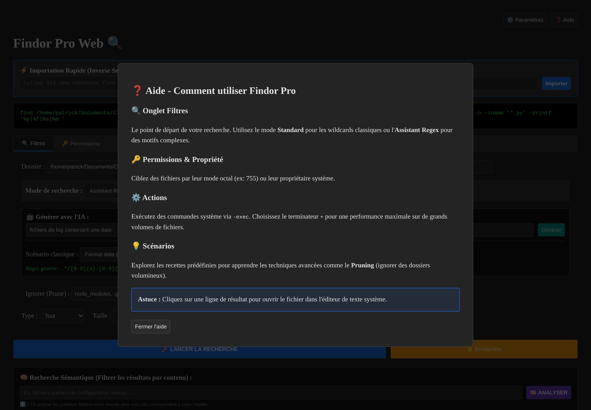
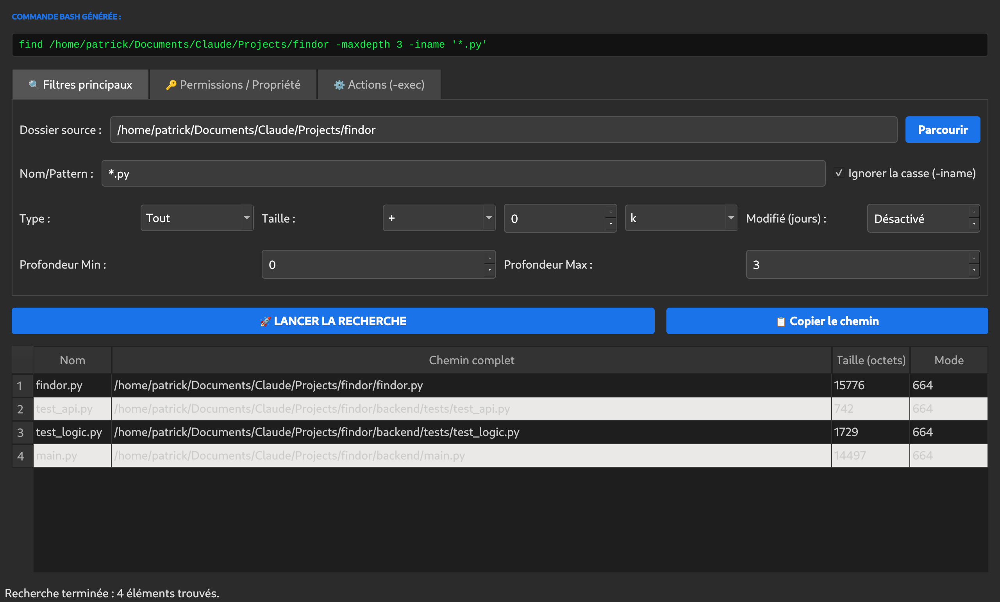
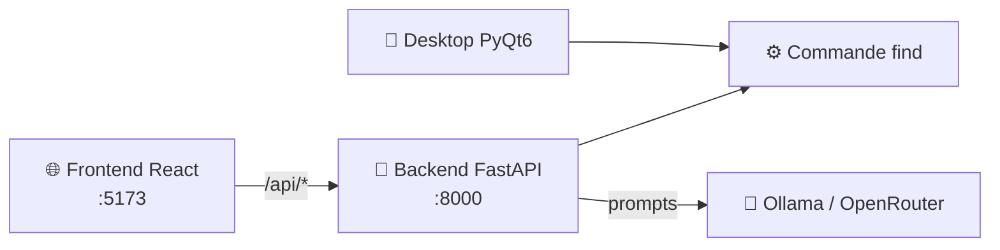

<div align="center">
  

  # Findor Pro 🔍

  ### L'interface ultime pour dompter la puissance de <code>find</code>

  [](https://github.com/nouhailler/findor)
  [](https://www.python.org/)
  [](https://react.dev/)
  [](https://fastapi.tiangolo.com/)
  [](LICENSE)
  [](https://www.linux.org/)

  <br>

  

</div>

---

## 📑 Sommaire

| | Section | | Section |
| :-: | :--- | :-: | :--- |
| 🌟 | [Introduction](#-introduction) | 📸 | [Galerie](#-galerie) |
| ✨ | [Fonctionnalités](#-fonctionnalités-clés) | 🏗️ | [Architecture](#️-architecture-du-projet) |
| 🚀 | [Installation](#-installation-rapide) | 🎯 | [Prise en main](#-prise-en-main) |
| 🛠️ | [Développement](#️-développement) | 🤖 | [Configuration IA](#-configuration-de-lia) |
| 📂 | [Structure](#-structure-du-projet) | 🤝 | [Contribution](#-contribution) |

---

## 🌟 Introduction

**Findor Pro** n'est pas qu'un simple wrapper. C'est un écosystème complet qui transforme la
complexité de la commande Bash `find` en une expérience fluide, pédagogique et augmentée par
l'Intelligence Artificielle. Que vous soyez un sysadmin chevronné ou un débutant sous Linux,
Findor Pro vous permet de localiser ne serait-ce qu'une aiguille dans une botte de foin numérique.

Disponible en **version Desktop native (PyQt6)** et en **version Web moderne (React/FastAPI)**.

> [!TIP]
> La commande `find` réellement exécutée est toujours affichée en vert dans le bandeau du haut.
> Sur la version Desktop, elle se met même à jour **en direct** à chaque filtre modifié : Findor Pro
> est autant un outil qu'un moyen d'apprendre `find`.

---

## 📸 Galerie

La capture en tête de ce README montre l'écran principal en thème sombre : importation inverse,
aperçu de la commande, onglets de filtres, recherche sémantique et tableau de résultats.

### ☀️ Interface Web — Thème Clair

Le même écran, basculé en mode clair depuis les paramètres.



<br>

<details>
<summary><b>💡 Onglet Scénarios — la bibliothèque de recettes</b> (cliquez pour déplier)</summary>
<br>

Cinq recettes prêtes à l'emploi. Un clic applique les filtres correspondants **et** affiche
l'explication pédagogique du mécanisme utilisé.



</details>

<details>
<summary><b>🤖 Assistant Regex — génération assistée par IA</b> (cliquez pour déplier)</summary>
<br>

Décrivez ce que vous cherchez en français, l'IA produit la regex compatible
`find -regextype posix-extended`. Sept scénarios classiques sont également disponibles sans IA.



</details>

<details>
<summary><b>⚙️ Paramètres — apparence et configuration IA</b> (cliquez pour déplier)</summary>
<br>

Basculez le thème et choisissez votre fournisseur d'IA. La liste des modèles est récupérée
dynamiquement : modèles installés localement pour Ollama, modèles `:free` pour OpenRouter.



</details>

<details>
<summary><b>❓ Aide intégrée</b> (cliquez pour déplier)</summary>
<br>

Un rappel contextuel de chaque onglet, accessible sans quitter l'application.



</details>

<details>
<summary><b>🐧 Version Desktop native (PyQt6)</b> (cliquez pour déplier)</summary>
<br>

L'alternative légère et sans navigateur, avec recherche dans un thread séparé pour ne jamais
figer l'interface.



</details>

---

## ✨ Fonctionnalités Clés

### 🤖 Intelligence Artificielle

| Fonctionnalité | Description |
| :--- | :--- |
| 🧠 **Recherche Sémantique** | L'IA lit le contenu des fichiers trouvés et ne garde que ceux qui répondent vraiment à votre question. |
| 💬 **Explications détaillées** | Pour chaque fichier, l'IA justifie en une phrase pourquoi il correspond — ou non. |
| ✍️ **Génération de Regex** | Décrivez votre motif en français, obtenez l'expression régulière. |
| 🔌 **Multi-Modèles** | **Ollama** (local, privé) ou **OpenRouter** (cloud), avec liste de modèles dynamique. |
| 🛑 **Annulable** | Un bouton STOP interrompt l'analyse IA à tout moment. |

### 🛠️ Puissance de Recherche

| Fonctionnalité | Description |
| :--- | :--- |
| 🎛️ **Visual Builder** | Taille, date, type, profondeur, permissions, propriétaire… sans mémoriser un seul flag. |
| ⚡ **Importation Inverse** | Collez une commande `find` existante, Findor remplit le formulaire pour vous. |
| ✂️ **Pruning** | Ignorez `node_modules`, `.git` & co. avec `-prune` pour des recherches instantanées. |
| 🔍 **Filtres Experts** | `-empty`, `-newer`, `-inum`, `-samefile`, `-perm`, `-mindepth`/`-maxdepth`. |
| 🚀 **Actions `-exec`** | Exécutez une commande sur les résultats, avec choix du terminateur `;` ou `+`. |
| ⭐ **Favoris** | Sauvegardez vos recherches récurrentes en un clic. |

### 🎨 Expérience Utilisateur

| Fonctionnalité | Description |
| :--- | :--- |
| 🌙 **Thèmes adaptatifs** | Mode Sombre et Clair, appliqués instantanément. |
| 📖 **Pédagogie intégrée** | Aperçu de la commande en direct, scénarios expliqués, aide contextuelle. |
| ⚙️ **Jamais figé** | Recherche dans un thread dédié côté Desktop, requêtes non bloquantes côté Web. |
| 🖱️ **Ouverture directe** | Un clic sur une ligne ouvre le fichier dans votre éditeur système. |
| 🖥️ **Multi-Interface** | Desktop native ou Web riche, au choix. |

---

## 🏗️ Architecture du Projet

Le projet est structuré de manière modulaire pour offrir une flexibilité totale :

| | Composant | Technologie | Rôle |
| :-: | :--- | :--- | :--- |
| 🐍 | **Desktop** | Python & PyQt6 | Application native ultra-rapide et légère. |
| ⚛️ | **Frontend Web** | React 19 & Vite | Interface moderne, réactive et élégante. |
| 🚀 | **Backend API** | FastAPI | Moteur de recherche et interface avec l'IA. |
| 📦 | **Packaging** | Debian (`.deb`) | Installation simplifiée sur les systèmes Linux. |



---

## 🚀 Installation Rapide

### 📦 Via le package Debian (recommandé)

```bash
sudo dpkg -i findor_3.0.0_all.deb
sudo apt-get install -f   # Répare les dépendances si nécessaire
```

### 🌐 Via le dépôt cloné

Le script tout-en-un crée l'environnement virtuel, installe les dépendances et lance les deux serveurs :

```bash
chmod +x start.sh
./start.sh
```

| Service | URL |
| :--- | :--- |
| 🌐 Frontend | <http://localhost:5173> |
| 📡 Backend (API) | <http://localhost:8000> |
| 📚 Docs API (Swagger) | <http://localhost:8000/docs> |

> [!NOTE]
> `Ctrl+C` arrête proprement les deux serveurs.

---

## 🎯 Prise en main

Un premier parcours en cinq étapes :

1. 📂 **Choisissez un dossier** — le champ *Dossier* est prérempli avec le répertoire courant.
2. 🏷️ **Décrivez la cible** — un motif type `*.log` en mode Standard, ou passez à l'*Assistant Regex*.
3. ✂️ **Excluez le bruit** — renseignez `node_modules, .git` dans *Ignorer (Prune)*.
4. 🚀 **Lancez la recherche** — la commande `find` exacte reste visible en haut de l'écran.
5. 🧠 **Affinez avec l'IA** *(optionnel)* — décrivez ce que le fichier doit contenir, puis **ANALYSER**.

> [!TIP]
> Vous avez déjà une commande `find` sous la main ? Collez-la dans **⚡ Importation Rapide** :
> Findor la désassemble et remplit le formulaire à votre place.

---

## 🤖 Configuration de l'IA

Les fonctions IA sont **optionnelles** — toute la recherche `find` fonctionne sans.

<table>
<tr><th>🏠 Ollama (local)</th><th>☁️ OpenRouter (cloud)</th></tr>
<tr valign="top">
<td>

Aucune clé, aucune donnée qui sort de votre machine.

```bash
# https://ollama.com
ollama pull qwen2.5:3b
ollama serve
```

URL par défaut : `http://localhost:11434`

</td>
<td>

Accès à de nombreux modèles, dont des modèles gratuits (`:free`).

```bash
cp .env.example .env
# puis renseignez OPENROUTER_KEY
```

Clé à créer sur <https://openrouter.ai>

</td>
</tr>
</table>

Le choix se fait dans **⚙️ Paramètres → 🤖 Configuration IA**, ou via les variables
d'environnement :

| Variable | Rôle | Défaut |
| :--- | :--- | :--- |
| `AI_PROVIDER` | `ollama` ou `openrouter` | `ollama` |
| `OLLAMA_URL` | URL du serveur Ollama | `http://localhost:11434` |
| `OPENROUTER_KEY` | Clé d'API OpenRouter | *(vide)* |
| `AI_MODEL` | Modèle utilisé | `qwen2.5:3b` |

> [!WARNING]
> La recherche sémantique envoie les **2000 premiers caractères** de chaque fichier texte analysé
> (50 fichiers maximum) au modèle. Avec OpenRouter, ce contenu quitte votre machine — préférez
> Ollama pour des fichiers sensibles.

---

## 🛠️ Développement

### Prérequis

| Outil | Version |
| :--- | :--- |
| 🐍 Python | 3.10+ |
| 📦 Node.js & npm | 18+ |
| 🖼️ PyQt6 | pour la version Desktop uniquement |

### 1️⃣ Backend (FastAPI)

```bash
cd backend
pip install -r requirements.txt
python3 main.py          # → http://localhost:8000
```

### 2️⃣ Frontend (React + Vite)

```bash
cd frontend
npm install
npm run dev              # → http://localhost:5173
```

### 3️⃣ Desktop (PyQt6)

```bash
pip install PyQt6
python3 findor.py
```

### 🧪 Tests & Packaging

Le `Makefile` regroupe les tâches courantes :

```bash
make help                # Liste toutes les cibles disponibles
make test                # Suite de tests pytest du backend
make package             # Génère le paquet .deb
make clean               # Nettoie les artefacts de build
```

---

## 📂 Structure du Projet

```text
findor/
├── 🐍 findor.py              # Application Desktop PyQt6
├── 🚀 backend/               # API FastAPI
│   ├── main.py               #   Moteur find + endpoints IA
│   ├── requirements.txt
│   └── tests/                #   Tests pytest
├── ⚛️ frontend/              # Interface React 19 (Vite + TS)
│   ├── src/App.tsx           #   Composant principal
│   ├── src/index.css         #   Thèmes clair / sombre
│   └── public/
├── 📸 docs/screenshots/      # Captures utilisées par ce README
├── 📦 build/                 # Sources des paquets Debian
├── 💿 findor_*.deb           # Paquets générés (v1 → v3)
├── ▶️ start.sh               # Lancement de la version Web
└── 🔨 package.sh, Makefile   # Outils de build
```

---

## 🤝 Contribution

Les contributions sont les bienvenues ! Consultez [CONTRIBUTING.md](CONTRIBUTING.md) pour les détails.

1. 🍴 Forkez le projet.
2. 🌿 Créez votre branche (`git checkout -b feature/AmazingFeature`).
3. 💾 Committez vos changements (`git commit -m 'Add some AmazingFeature'`).
4. 📤 Pushez vers la branche (`git push origin feature/AmazingFeature`).
5. 🎉 Ouvrez une Pull Request.

---

<div align="center">

**Développé avec ❤️ pour la communauté Linux.** Sous licence [MIT](LICENSE).

<a href="https://github.com/nouhailler/findor">
  
</a>

</div>
